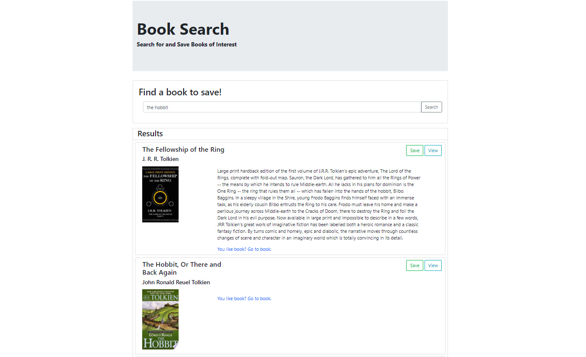

# Book Search <!-- omit in toc -->
--- 
### Table of Contents

- [Description](#description)
  - [Technologies Used](#technologies-used)
- [Installation](#installation)
- [How to use it](#how-to-use-it)
- [Future Development](#future-development)
- [Credits](#credits)
- [How to contribute](#how-to-contribute)
- [Tests](#tests)
- [License](#license)

## Live Site
[View Now](https://rocky-river-50444.herokuapp.com/)

## Description
A simple app for reading book descriptions and saving a reading list.

___Technologies Used___
- React
- Mongodb
- Heroku

___Motivation___
Read more books

## Installation
Project deployed. No installatioin necessary

## How to use it
See a list of books by typing what you're looking for in the search box and clicking 'search'. Add a book to your reading list by clicking "save" and view the book's listing by clicking "view". To view your reading list, click "saved" in the top navigation. On the 'saved' page, you can delete a book from the database with the 'delete' button.

## Future Development
Multiple book lists. Audible integration. Better mobile responsiveness.

### Credits
Developers: C.T. Bell
### How to contribute
email me

### Tests
No tests provided

### License
#####MIT
[Link to MIT licence](https://opensource.org/licenses/MIT)

### Questions
If you have a question about this software, contact the developer at:
charlestbell@gmail.com

